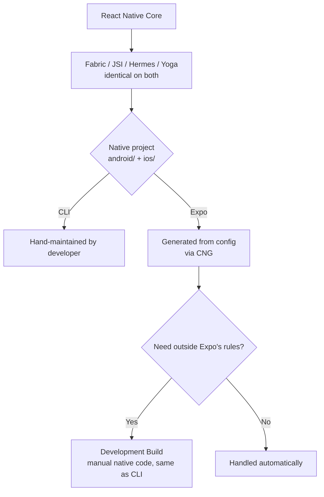
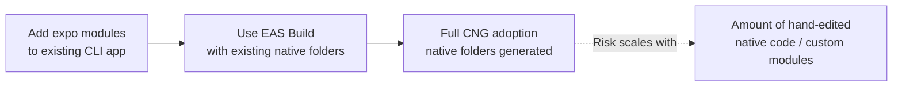

# React Native: CLI vs Expo

## Quick Recall
- Identical React Native runtime under both — no architecture difference (same Fabric, JSI, Hermes, Yoga).
- The only real difference: **who owns and maintains the native project** (`android/`, `ios/`) — you (CLI) or a framework (Expo).
- Expo's abstraction is **rule-bound**: config, plugins, curated `expo-*` packages. Outside those rules, it's the same manual native work as CLI.
- "Ejecting" no longer exists — native customization inside Expo happens via **Development Builds**, not by leaving the framework.
- Migration difficulty (CLI → Expo) depends on how much existing native code falls outside Expo's config-plugin coverage — not on which features you want.

---

## What Each One Is

| | React Native CLI | Expo |
|---|---|---|
| Definition | `@react-native-community/cli` — generates a bare RN project, native folders committed to repo | A framework + toolchain on top of RN: curated native modules, config-driven native generation, Expo Router, EAS |
| Native project | Hand-maintained | Generated from config (Continuous Native Generation) |
| Build | Local (Gradle/Xcode) or self-built CI | Local, or EAS Build (cloud) |

---

## Core Difference: Ownership, Not Architecture

---

## Comparison Table

| | CLI | Expo |
|---|---|---|
| Native customization | Direct file edits | Config plugins; Dev Build for anything plugins don't cover |
| Library ecosystem | Any RN-compatible library, manual linking | Curated `expo-*` + any compatible RN library |
| Version upgrades | Manual diff of native template | Versioned SDK, guided upgrade path |
| iOS build without Mac | Not possible | Possible via EAS cloud build |
| Routing | Developer's choice (typically React Navigation) | Expo Router (built on React Navigation) by default |
| OTA updates | Self-built, or none | EAS Update, built in |
| Cloud CI/build/submit | Self-built | EAS (Build, Update, Submit) |

---

## Pros & Cons

**CLI**
- ✅ Full native control, no dependency on Expo's release cadence
- ✅ Direct native debugging
- ❌ Manual native project maintenance, upgrades, library linking
- ❌ No built-in cloud build/update service

**Expo**
- ✅ Native project auto-managed (CNG)
- ✅ Curated libraries reduce integration work
- ✅ EAS = build/update/submit without separate CI setup
- ❌ Native work outside config-plugin coverage still needs manual code (via Dev Build)
- ❌ Tied to Expo SDK's compatibility schedule
- ❌ EAS beyond free tier is paid

---

## Migration Path (CLI → Expo)

**Key deciding fact:** not which Expo features you want — how much existing native customization falls outside what config plugins can express.

---

## Gotchas / Common Mistakes
- **"CLI = build your own framework"** — false. CLI ships a working native template; you assemble libraries on top, you don't author infrastructure.
- **"CLI has no rules"** — false. You still work within React Native's own core conventions (Metro, Gradle/CocoaPods syntax, `AndroidManifest.xml` format). Expo adds a *second* layer of rules on top; CLI just lacks that second layer.
- **"Ejecting" from Expo** — outdated concept. Current model: Development Builds, not ejecting.
- **CORS "protecting" a mobile API** — CORS is browser-only and irrelevant once there's no browser involved (true on both CLI and Expo apps). Auth/validation must be server-side regardless.
- **Assuming Expo removes all library decisions** — only true within Expo's rule set; anything outside it (custom native modules, non-standard config) is the same manual work as CLI.
