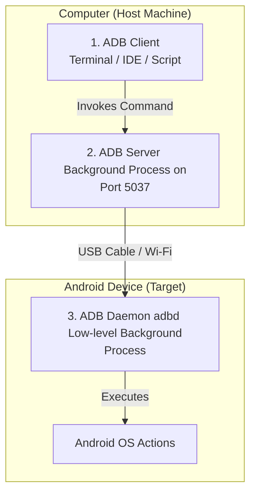

# Study Notes: ADB Architecture & Device Control

## Quick Recall
* **The Blueprint:** **ADB (Android Debug Bridge)** is a three-part client-server engine used to control Android hardware/emulators from your terminal.
* **The Bridge Components:** The architecture splits into a local terminal **Client**, a background PC **Server**, and a mobile-side **Daemon**.
* **Device Control:** You can boot, restart, or safely terminate device runtime connections directly via targeted CLI arguments.

---

## The Three-Component Architecture

ADB manages tasks by separating commands, background routing, and execution into three distinct layers:

### 1. The Client
* **Definition:** The interface you interact with directly in your shell workspace. 
* **Function:** When you type any `adb` instruction (e.g., `adb devices`), you are running the client. It parses your syntax inputs, checks for flags, and routes the request down to the server thread.

### 2. The Server
* **Definition:** A persistent background process (daemon) running on your computer.
* **Function:** It initializes automatically the first time you run an ADB command. It listens continuously on local port `5037` to act as a traffic hub, managing the data flow between your active terminal windows and any connected phones or emulators.

### 3. The Daemon (adbd)
* **Definition:** A background system utility running directly inside the Android operating system kernel space.
* **Function:** It acts as the execution engine on the target device. It listens for incoming packets sent from the PC server, translates them into internal system calls, and executes the actions (like installing an app bundle or pulling a file directory).

---

## CLI Control Matrix: Initialization & Power Commands

| CLI Command | Primary Function | Technical Workflow / Use Case |
| :--- | :--- | :--- |
| `adb start-server` | Boots the PC background server process. | Manually forces the communication hub to open if it fails to spin up automatically. |
| `adb kill-server` | Destroys the PC background server instance. | Closes down port `5037` to clear out frozen processes or buggy device linkages. |
| `adb reboot` | Restarts the connected physical phone or emulator. | Power-cycles the device system directly from the terminal layout. |
| `adb reboot recovery` | Reboots the phone straight into its native recovery console. | Advanced debugging tool used to flash system packages or clear low-level device cache nodes. |
| `adb emu kill` | Shuts down a running virtual emulator layout instance. | **Stop Command:** Instantly kills the local Android Studio emulator window directly from the command line. |

---

## Gotchas / Common Mistakes
* **The Ghost Server Freeze:** If your terminal hangs indefinitely when typing commands, the local ADB server has likely entered a locked state. Run `adb kill-server` followed immediately by `adb start-server` to reset the pipeline.
* **Emulator Shutdown Permission Denied:** Running `adb emu kill` on some Windows configurations requires terminal administrator level privileges or explicit emulator authentication tokens. If it errors out, you can stop a local virtual machine safely by simply closing its native window.
