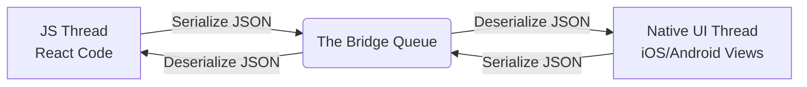
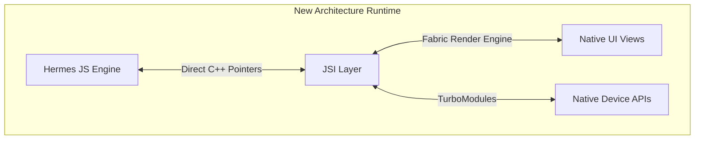
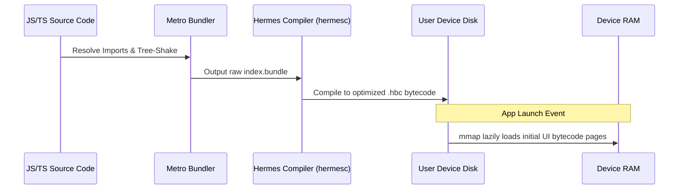

# Study Notes: React Native Architecture Evolution

## Quick Recall
* **The Core Shift:** React Native replaced the asynchronous JSON message **Bridge** with the synchronous C++ **JSI (JavaScript Interface)**.
* **Old Engine vs New Engine:** Legacy apps used **JavaScriptCore (JSC)** which parsed JS at runtime; modern apps use **Hermes** to execute pre-compiled bytecode ahead of time.
* **UI & Module Evolution:** **Fabric** enables multi-threaded, synchronous UI rendering, while **TurboModules** allow lazy-loading of native features.
* **The Compilation Glue:** **Codegen** automatically scaffolds the type-safe C++ interface layer required to connect JavaScript and Native directly.

---

## Architectural Deep Dive

### The Old Architecture (The Bridge)
* **Execution:** Separated into the JavaScript Thread and the Native Main Thread.
* **Communication Bottleneck:** Relied on a single, asynchronous **Bridge** channel. Data had to be fully serialized into JSON strings on one side and deserialized on the other.
* **Engine Limitations:** Used **JSC (JavaScriptCore)** which read raw text bundles at runtime, causing slow app boot times and dropped frames during heavy message congestion.

### The New Architecture (Bridge-less)
* **Foundational Layer:** Replaces the Bridge with **JSI (JavaScript Interface)**, an abstraction layer written in C++.
* **Direct Access:** Allows the JavaScript engine (**Hermes**) to hold direct memory references to native host objects.
* **Performance Gains:** Eliminates JSON serialization entirely, enabling synchronous communication and multi-threaded layouts.

---

## Component Breakdown

### Metro & Hermes (The Build Pipeline)
* **Metro Bundler:** Aggregates thousands of source files into a single `index.bundle` file at build time.
* **Hermes Engine:** A specialized JavaScript engine optimized for mobile. Instead of parsing raw text on the device, it uses Ahead-of-Time (AOT) compilation to turn the Metro bundle into highly efficient `.hbc` bytecode.
* **Production Advantage:** Uses memory mapping (`mmap`) to load bytecode pages lazily from disk into RAM, cutting startup times drastically.

### Fabric & TurboModules (The Execution Layer)
* **Fabric:** The re-engineered C++ rendering engine. It replaces the old shadow tree and interacts directly with JSI to trigger synchronous UI updates and non-blocking layout checks using Yoga.
* **TurboModules:** The next-generation native module configuration. It enables lazy loading of device hardware interfaces (e.g., Camera, Bluetooth), preventing memory usage until explicitly invoked by the code.
* **Codegen:** A build-time command-line scanner that reads TypeScript/Flow typings and automatically writes the foundational C++ wrappers needed to lock Fabric and TurboModules together.

---

## Structural Comparison

| Architectural Element | Old Architecture (Legacy) | New Architecture (Modern) |
| :--- | :--- | :--- |
| **Communication Layer** | Asynchronous JSON message **Bridge** | Synchronous C++ **JSI** (Direct Memory) |
| **Primary JS Engine** | **JavaScriptCore (JSC)** | **Hermes** (Bytecode Optimization) |
| **Compilation Phase** | Just-In-Time / Runtime text parsing | Ahead-of-Time (AOT) to `.hbc` binary |
| **UI Rendering System** | Asynchronous Shadow Tree | **Fabric** (Multi-threaded C++ Tree) |
| **Native Module Lifecycle** | Eager Initialization (All loaded at boot) | **TurboModules** (Lazy on-demand execution) |
| **Interface Security** | Loosely checked JSON parameters | **Codegen** enforced static type safety |

---

## Gotchas / Common Mistakes
* **The Async-to-Sync Trap:** While JSI allows synchronous calls, blocking the Native UI thread with heavy, long-running JavaScript execution will freeze the app interface.
* **Missing Codegen Declarations:** Forgetting to type native interfaces correctly in TypeScript will cause Codegen to fail during the build step before native compilation ever begins.
* **Development Flow Illusion:** In the development phase, Hermes bypasses bytecode compilation to maintain Fast Refresh speed. Performance benchmarks regarding startup times should only be measured using release configurations.
