# Chapter 1 — Components + JSX

> **Learning Goal**
> Understand the fundamental mental model of React Native: **UI is built by composing components, and JSX describes what that UI should look like.**

---

## 1. What Is a Component?

A **component** is a reusable piece of UI that can also contain its own behavior and logic.

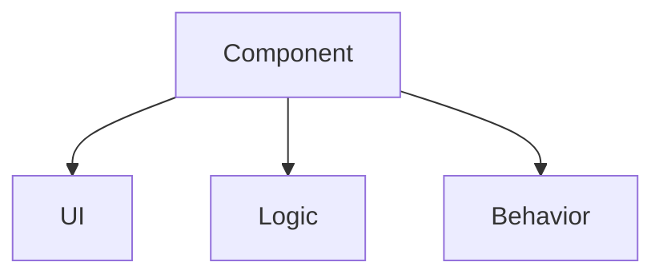

**Example:**

```jsx
function WelcomeScreen() {
  return (
    <View>
      <Text>Foodie</Text>
      <Text>Welcome to Foodie</Text>
      <Text>Find your next meal.</Text>
    </View>
  );
}
```

A component can then be **used** as:

```jsx
<WelcomeScreen />
```

### ⚠️ Important Distinction

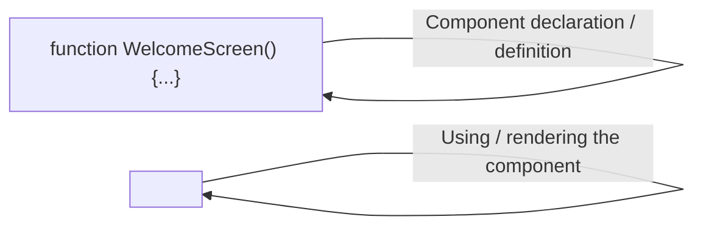

| Syntax | Meaning |
|---|---|
| `function WelcomeScreen() {}` | **Declaring / defining** the component |
| `<WelcomeScreen />` | **Using / rendering** the component |

---

## 2. JSX

JSX lets us describe UI using syntax that looks similar to HTML.

```jsx
<Text>Foodie</Text>
```

> **JSX is not HTML.** React Native uses JSX to describe a *native* UI component tree.

### JSX Mental Model

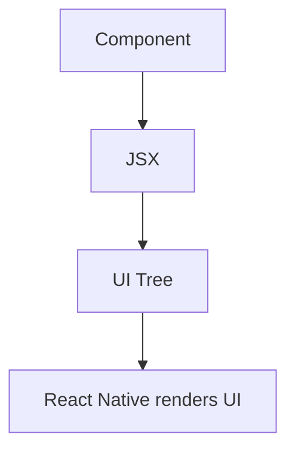

---

## 3. `View`

`View` is the general-purpose **container / layout** component.

> It is conceptually similar to a `div` on the web — but it is **not literally a div**.

```jsx
<View>
  <Text>Foodie</Text>
  <Text>Welcome</Text>
</View>
```

**Think of `View` as:**

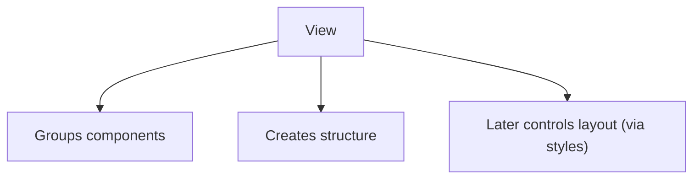

---

## 4. `Text`

React Native uses `Text` to render visible text.

```jsx
<Text>Foodie</Text>
```

> ❌ Do **not** treat `View` as a replacement for `Text`.

```jsx
// Wrong
<View>Foodie</View>

// Correct
<View>
  <Text>Foodie</Text>
</View>
```

---

## 5. Component Hierarchy / Tree

React Native UI is **hierarchical**.

**Example structure:**

```
App
└── WelcomeScreen
    └── View
        ├── Text
        ├── Text
        └── Text
```

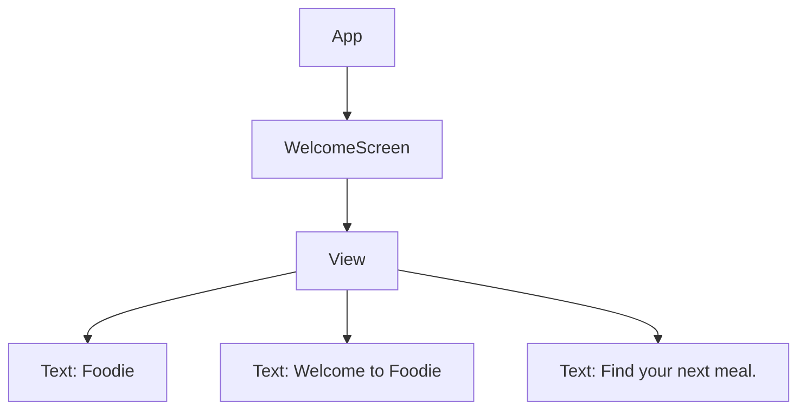

### 💡 Why This Matters

A real Foodie screen will eventually become:

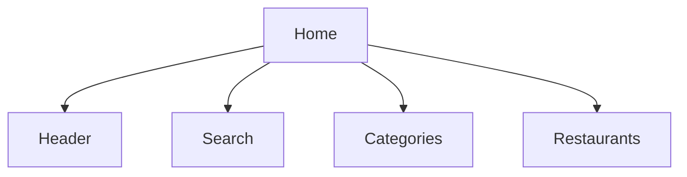

Each section can become **its own component**.

---

## 6. Component Composition

Large interfaces are built by **composing smaller components**.

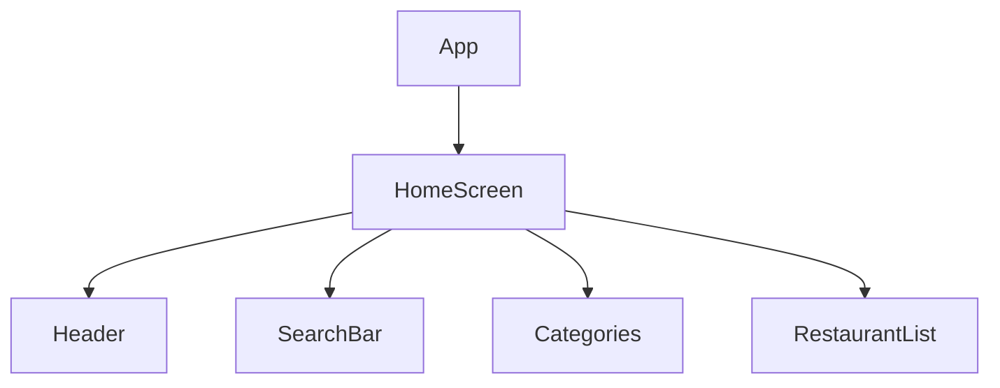

### 🔑 Key Idea

| ❌ Don't think | ✅ Think |
|---|---|
| "I need to build one huge screen." | "I need to compose several smaller pieces into one screen." |

---

## 7. JavaScript Expressions Inside JSX

JavaScript expressions can be placed inside JSX using `{}`.

```jsx
const restaurantName = "Burger House";

<Text>{restaurantName}</Text>
```

> The braces mean: **evaluate this JavaScript expression and use its result here.**

### Example

```jsx
const price = 250;
const quantity = 2;

<Text>₹{price * quantity}</Text>
```

**Output:**

```
₹500
```

### Mental Model


### ⚠️ Important Clarification

`{}` accepts a JavaScript expression, but **not every resulting value can be rendered directly.**

```jsx
const restaurant = { name: "Burger House", rating: 4.5 };
```

✅ **This is useful:**

```jsx
<Text>{restaurant.name}</Text>
<Text>{restaurant.rating}</Text>
```

❌ **Rendering the whole object directly is not the normal way to use JSX.**

```jsx
<Text>{restaurant}</Text> // Not the intended usage
```

---

## 8. Declarative UI

React Native uses a **declarative** approach.

### Imperative (what we *don't* do)

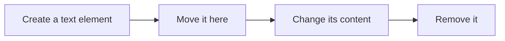

### Declarative (what React does)

We describe **what the UI should be**:

```jsx
<Text>{restaurantName}</Text>
```

React/React Native handles updating the UI based on the component's current data.

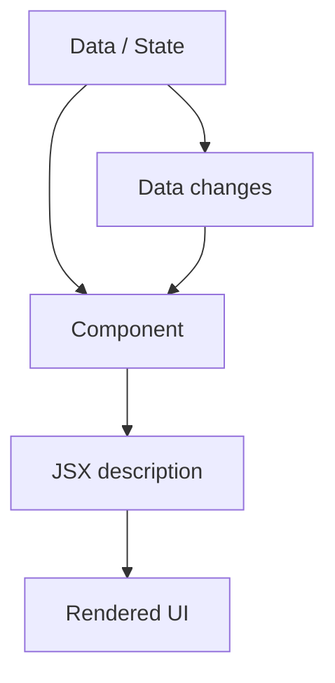

---

## 9. Reusable Component Example

A simple Foodie structure:

```jsx
function WelcomeScreen() {
  return (
    <View>
      <Text>Foodie</Text>
      <Text>Welcome to Foodie</Text>
      <Text>Find your next meal.</Text>
    </View>
  );
}

function App() {
  return <WelcomeScreen />;
}
```

**Hierarchy:**

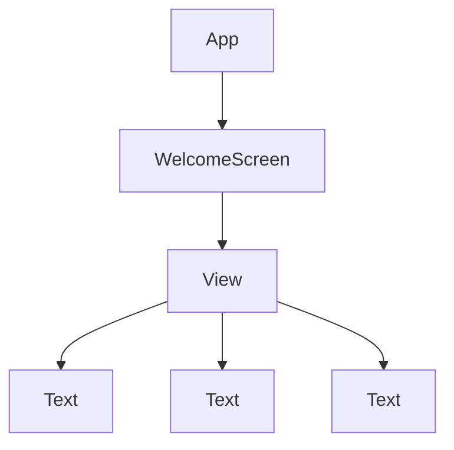

---

## 10. 🍔 Foodie Application of Chapter 1

Our eventual **Home screen** will be decomposed into:

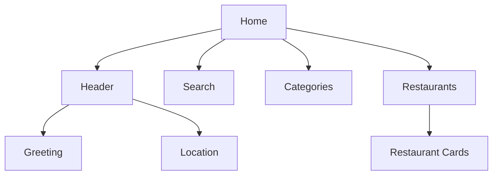

This is the foundation for everything that follows.

---

## 📋 Chapter 1 Summary

| Concept | Core Idea |
|---|---|
| **Component** | Reusable UI + potentially logic/behavior |
| **JSX** | Describes the UI structure |
| **View** | General-purpose container |
| **Text** | Renders text |
| **Component tree** | Shows parent/child UI relationships |
| **Composition** | Builds large UI from smaller components |
| **`{}`** | Embeds JavaScript expressions inside JSX |
| **Declarative UI** | Describe what UI *should be*; React handles updates |

---

## ✅ Recall Checklist

Before moving forward, you should be able to explain:

- [ ] What a component is
- [ ] Difference between **defining** and **using** a component
- [ ] Why `View` is used
- [ ] Why text belongs inside `Text`
- [ ] How a component tree works
- [ ] What component composition means
- [ ] What `{}` does inside JSX
- [ ] Difference between **declarative** and **imperative** UI

---

## 🎯 Chapter 1 — Complete

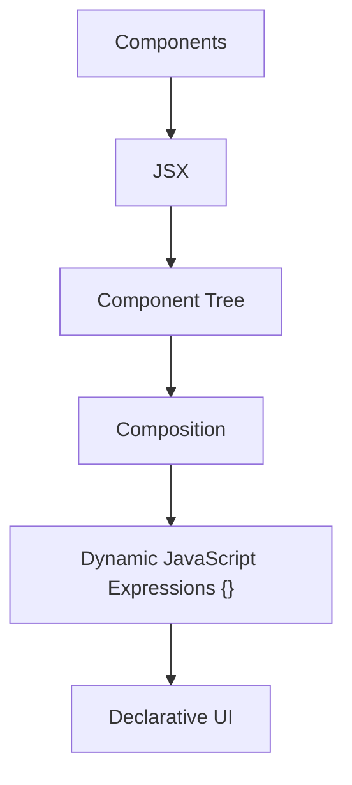
