# Chapter 2 — Core React Native Components

> **Learning Goal**
> Learn the main React Native components used to build interactive mobile interfaces: `View`, `Text`, `Pressable`, `TextInput`, `ScrollView`, `FlatList`.
>
> `View` and `Text` were already introduced in Chapter 1, so this chapter builds on that knowledge rather than relearning it.

---

## 1. Foodie Home UI Outline

Before implementation, define the UI as a component tree.

```
Home
│
├── Header
│   ├── Foodie
│   └── Find your next meal
│
├── Search
│   └── TextInput
│
├── Categories
│   ├── Pressable → Burger
│   ├── Pressable → Pizza
│   └── Pressable → Sushi
│
└── Restaurants
    ├── Burger House
    ├── Pizza Palace
    └── Sushi World
```

**Component representation:**

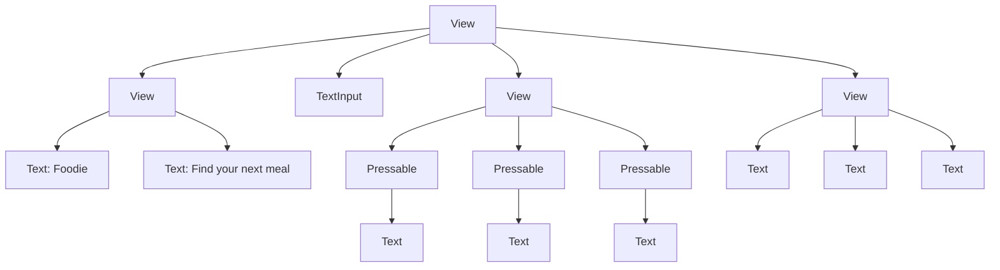

---

## 2. `View` — Recall

*Covered in Chapter 1.*

Use `View` as a general-purpose container for grouping UI and controlling layout.

```jsx
<View>
  <Text>Foodie</Text>
</View>
```

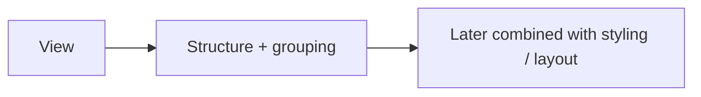

---

## 3. `Text` — Recall

*Covered in Chapter 1.*

Use `Text` for visible text.

```jsx
<Text>Pizza Palace</Text>
```

It can also display values from JavaScript:

```jsx
const name = "Pizza Palace";

<Text>{name}</Text>
```

---

## 4. `Pressable`

`Pressable` makes a UI element respond to press interactions.

```jsx
<Pressable onPress={() => console.log("Pressed!")}>
  <Text>Add to Cart</Text>
</Pressable>
```

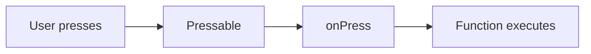

### Main Props

| Prop | Purpose |
|---|---|
| `onPress` | Defines what happens when the user presses |
| `onLongPress` | Runs when the user holds the element |
| `disabled` | Prevents interaction |
| `hitSlop` | Increases the touchable area without changing visible size |
| `style` | Styles the pressable; can react to pressed state |

#### `onPress`

```jsx
<Pressable
  onPress={() => {
    console.log("Burger pressed");
  }}
>
  <Text>Burger</Text>
</Pressable>
```

#### `onLongPress`

```jsx
<Pressable
  onLongPress={() => {
    console.log("Long press");
  }}
>
  <Text>Restaurant</Text>
</Pressable>
```

#### `disabled`

```jsx
<Pressable disabled>
  <Text>Add to Cart</Text>
</Pressable>
```

> Useful when an action should temporarily be unavailable.

#### `hitSlop`

Useful for small buttons/icons — expands the touch zone without changing the visible element size.

#### `style`

Can style the pressable and react to pressed state.
> We will explore this properly during the styling chapter.

---

## 5. `TextInput`

`TextInput` receives text from the user.

```jsx
<TextInput placeholder="Search restaurants..." />
```

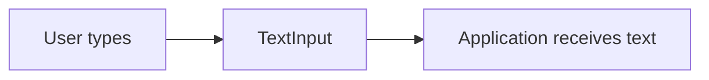

### Main Props

#### `placeholder`

Displays a hint when the input is empty.

```jsx
<TextInput placeholder="Search restaurants..." />
```

#### `onChangeText`

Runs whenever the input text changes.

```jsx
<TextInput
  onChangeText={(text) => {
    console.log(text);
  }}
/>
```

> If the user types `burger`, the callback receives the updated text as the user types.

#### `keyboardType`

Controls the type of keyboard suggested by the device.

```jsx
keyboardType="default"
keyboardType="email-address"
keyboardType="phone-pad"
keyboardType="numeric"
keyboardType="decimal-pad"
```

| Input | Example |
|---|---|
| Search | `default` |
| Email | `email-address` |
| Phone | `phone-pad` |
| Number | `numeric` |
| Decimal | `decimal-pad` |

#### `secureTextEntry`

Hides entered text, commonly for passwords.

```jsx
<TextInput secureTextEntry />
```

#### `multiline`

Allows multiple lines.

```jsx
<TextInput multiline />
```

Useful for:
- Delivery instructions
- Comments
- Address notes

#### `editable`

Controls whether the user can edit the input.

```jsx
<TextInput editable={false} />
```

#### `maxLength`

Limits the number of characters.

```jsx
<TextInput maxLength={50} />
```

---

## 6. Important `TextInput` Distinction

Two props become especially important later:

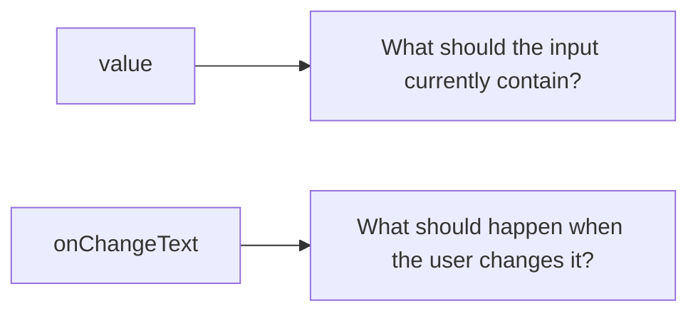

```jsx
<TextInput
  value={searchText}
  onChangeText={(text) => {
    // update searchText later using state
  }}
/>
```

> ⚠️ State will be introduced later. Do **not** jump ahead and memorize the full pattern yet.

---

## 7. `ScrollView`

`ScrollView` creates a scrollable area containing its children.

```jsx
<ScrollView>
  <Text>Restaurant 1</Text>
  <Text>Restaurant 2</Text>
  <Text>Restaurant 3</Text>
</ScrollView>
```

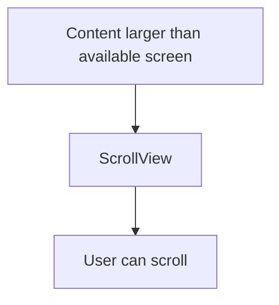

### Main Props

| Prop | Purpose |
|---|---|
| `horizontal` | Changes vertical scrolling to horizontal scrolling |
| `showsHorizontalScrollIndicator` | Controls the horizontal scroll indicator |
| `contentContainerStyle` | Styles the container holding the scrollable content |
| `keyboardShouldPersistTaps` | Controls how taps behave when the keyboard is open |

#### `horizontal`

```jsx
<ScrollView horizontal>
  ...
</ScrollView>
```

Useful for category chips:

```
[Burger] [Pizza] [Sushi] [Tacos] →
```

#### `showsHorizontalScrollIndicator`

```jsx
<ScrollView
  horizontal
  showsHorizontalScrollIndicator={false}
>
```

#### `contentContainerStyle`

> We will use this more after learning `StyleSheet` and Flexbox.

#### `keyboardShouldPersistTaps`

Becomes useful when a screen contains both a text input and interactive content.

---

## 8. `ScrollView` vs `FlatList`

This is an important distinction.

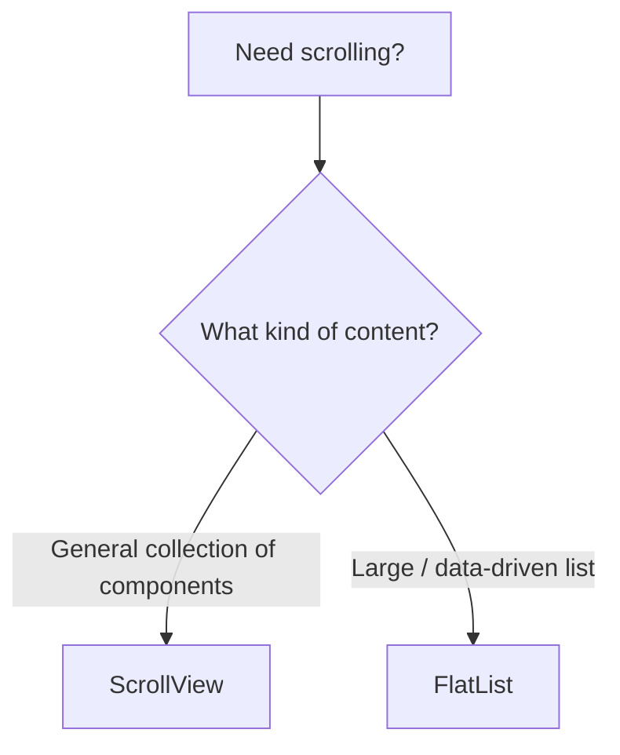

| | Purpose |
|---|---|
| **ScrollView** | General scrollable content |
| **FlatList** | Data-driven list |

- A `ScrollView` renders its children as part of the scrollable content.
- A `FlatList` is specifically designed around lists of data and can **optimize which items need to be rendered.**

---

## 9. `FlatList`

Suppose Foodie has:

```jsx
const restaurants = [
  { name: "Burger House" },
  { name: "Pizza Palace" },
  { name: "Sushi World" },
];
```

Instead of manually writing:

```jsx
<Text>Burger House</Text>
<Text>Pizza Palace</Text>
<Text>Sushi World</Text>
```

we can use `FlatList`.

**Basic form:**

```jsx
<FlatList
  data={restaurants}
  renderItem={({ item }) => (
    <Text>{item.name}</Text>
  )}
/>
```

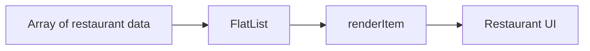

### Main `FlatList` Props

| Prop | Purpose |
|---|---|
| `data` | The array of items to display |
| `renderItem` | Defines how each item should be rendered |
| `keyExtractor` | Provides a stable key for each item |
| `horizontal` | Creates a horizontal list |
| `numColumns` | Allows multiple columns |
| `ListHeaderComponent` | Adds content above the list |
| `ListEmptyComponent` | Defines what appears when the data array is empty |
| `onEndReached` | Runs when the user gets near the end of the list |

#### `data`

```jsx
<FlatList data={restaurants} />
```

#### `renderItem`

```jsx
renderItem={({ item }) => (
  <Text>{item.name}</Text>
)}
```

> `item` → one restaurant from the array

#### `keyExtractor`

```jsx
keyExtractor={(item) => item.id}
```

> Particularly important when restaurant data has IDs.

#### `horizontal`

```jsx
<FlatList
  horizontal
  data={categories}
  ...
/>
```

Useful for category lists.

#### `numColumns`

```jsx
<FlatList
  numColumns={2}
  ...
/>
```

Useful for grid-style layouts.

#### `ListHeaderComponent`

Adds content above the list. Useful when a screen has:

```
Header
Search
Categories
----------------
Restaurant list
```

#### `ListEmptyComponent`

Defines what appears when the data array is empty.

```
No restaurants found.
```

#### `onEndReached`

Runs when the user gets near the end of the list. Useful later for:
- Pagination
- Load more
- Infinite scrolling

---

## 10. Core Component Comparison

| Component | Main Job | Foodie Example |
|---|---|---|
| `View` | Container / structure | Header container |
| `Text` | Display text | Restaurant name |
| `Pressable` | Handle presses | Add to Cart |
| `TextInput` | Receive user text | Search |
| `ScrollView` | Scroll general content | Horizontal categories |
| `FlatList` | Render data-driven lists | Restaurants |

---

## 11. Foodie Interaction Flow

Our current screen works roughly like this:

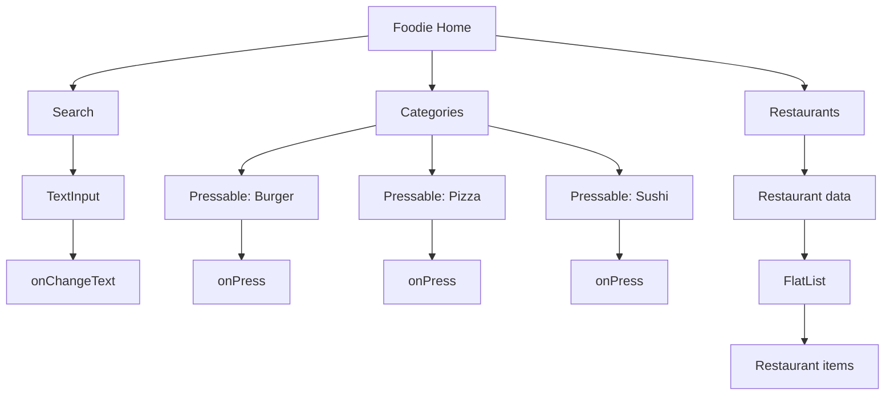

---

## 12. Important Conceptual Boundary

At this point, we **can** receive user input:

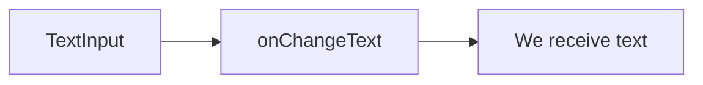

But we have **not yet** learned state.

Therefore, we are **not yet** building:

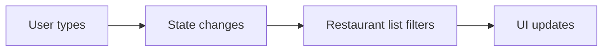

> That belongs to the upcoming **State + Events** chapter. This separation is intentional.

---

## 13. What We Built Today

The first Foodie Home structure:

```
Home
│
├── Header
│   ├── Foodie
│   └── Find your next meal
│
├── Search
│   └── TextInput
│
├── Categories
│   ├── Burger → Pressable
│   ├── Pizza → Pressable
│   └── Sushi → Pressable
│
└── Restaurants
    ├── Burger House
    ├── Pizza Palace
    └── Sushi World
```

**Current capabilities:**

- ✅ Component-based UI
- ✅ JSX
- ✅ Component hierarchy
- ✅ Dynamic JSX expressions
- ✅ Text input
- ✅ Press interactions
- ✅ Basic list concepts

---

## 14. What We Deliberately Did *NOT* Learn Yet

These are coming later:

- State
- Props
- Filtering
- Arrays + `map()`
- Advanced FlatList usage
- Navigation
- API data
- Loading states
- Cart state
- Context
- Reducers
- Forms
- Styling / Flexbox

> The goal is to learn each concept when we actually have a reason to use it.

---

## 📊 Chapter 2 Progress

| Component | Status |
|---|---|
| View | 🟢 |
| Text | 🟢 |
| Pressable | 🟢 |
| TextInput | 🟢 |
| ScrollView | 🟢 |
| FlatList | 🟢 |

---

## Chapter 2 Core Mental Model

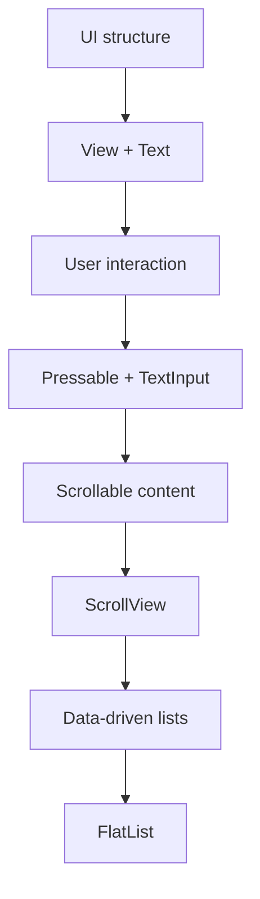

---

## ✅ End-of-Day Recall Questions

Before tomorrow, try answering these without looking at the notes:

- [ ] Why does React Native use `Text` instead of putting raw text directly inside `View`?
- [ ] What does `onPress` represent?
- [ ] What's the difference between `Text` and `TextInput`?
- [ ] What's the difference between `ScrollView` and `FlatList`?
- [ ] What are `data` and `renderItem` used for in `FlatList`?
- [ ] What is the difference between `value` and `onChangeText` conceptually?
- [ ] Why haven't we implemented search filtering yet?

---

## 🎯 Chapter 2 Complete

The next major chapter is:

> **Chapter 3 — Styling + Flexbox**

There we'll take the plain Foodie screen we built today and turn it into an actual mobile UI while learning `StyleSheet`, Flexbox, spacing, sizing, alignment, and layout principles.
