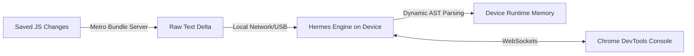
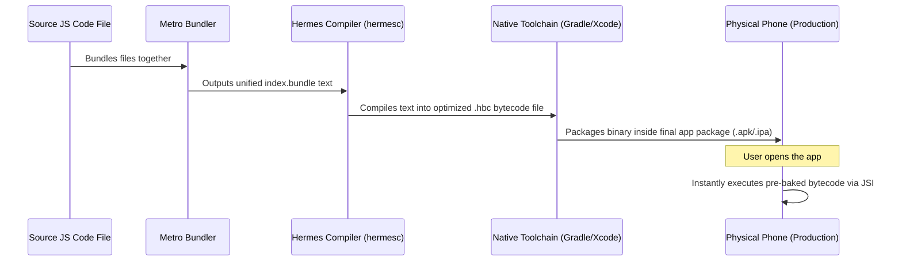

# Study Notes: The Hermes Engine

## Quick Recall
* **The Core Shift:** Hermes changes JavaScript execution from **Just-In-Time (JIT)** browser parsing to **Ahead-of-Time (AOT)** mobile compilation.
* **The Production Output:** Instead of shipping raw JavaScript strings to app stores, it generates a pre-optimized **`.hbc` binary bytecode** file.
* **Instant Startup (`mmap`):** It maps the bytecode file directly from storage disk to memory, loading only the pages needed for the active screen to save RAM.
* **Hades Garbage Collector:** A custom, mobile-first garbage collector that cleans memory concurrently on a background thread to prevent UI micro-stutters.

---

## The Build and Runtime Pipeline

### Development Phase (Dynamic Sandbox)
* **No AOT Bytecode:** To keep **Fast Refresh** instant, Hermes acts like a traditional interpreter during local development. It skips the bytecode compilation step entirely.
* **Raw Execution:** Metro watches your codebase and streams raw JavaScript text changes to the device, which Hermes parses on the fly.
* **Integrated Debugging:** Hermes exposes a WebSocket connection using the Chrome DevTools Protocol, linking your running code straight into Chrome's inspector console.

### Production Release Phase (Ahead-of-Time Pipeline)
* **The compilation shift:** The compilation work is fully completed on your build machine (laptop/CI server) using the Hermes compiler CLI utility (`hermesc`).
* **Bytecode Injection:** The resulting `.hbc` bytecode is bundled directly inside your native application container (`.apk` or `.ipa`).

---

## Internal Runtime Architecture

### Register-Based VM vs Stack-Based VM
* **Traditional Web Engines (JSC/V8):** Historically designed around a stack-based structure where values are pushed and popped continuously, leading to more instructions.
* **Hermes VM:** Designed explicitly around a **register-based** virtual machine architecture. It maps operations directly to a fixed set of virtual registers, generating fewer internal bytecode instructions and reducing CPU cycles.

### Hades Concurrent Garbage Collector
* **The Challenge:** Traditional engines stop application execution to sweep memory, creating noticeable lag (jank) during animations.
* **The Hades Solution:** Runs its memory compaction routines on a dedicated background thread, leaving the main JavaScript execution track unhindered.

---

## Architectural Profile: Development vs Production

| Execution Metric | Development Flow | Production Release Flow |
| :--- | :--- | :--- |
| **Primary Code Format** | Raw JavaScript Text Strings | Pre-compiled **`.hbc` Bytecode Binary** |
| **Compilation Timing** | Just-In-Time runtime interpretation | **Ahead-of-Time (AOT)** build compilation |
| **Memory Allocation** | Loads bundle into system RAM | Uses **`mmap`** to stream pages lazily from disk |
| **Developer Tools** | Active WebSocket connection for debugging | Stripped out for performance and security |
| **Error Trace Handling** | Metro source maps resolve line errors | Internal memory offset tracking |

---

## Gotchas / Common Mistakes
* **JIT Performance Expectation:** Because Hermes intentionally does not include a JIT compiler to keep the engine compact, raw math-heavy benchmarks (like running massive loops) can occasionally run slower than in standard desktop browsers.
* **Obfuscated Production Stack Traces:** Because production builds crash on bytecode rather than standard text strings, production crash logs show internal memory addresses instead of filenames. You must use a generated source map to symbolicate the logs back to readable code.
* **Micro-Stuttering in Debug Mode:** Profiling memory or tracking animations in a development build can give false results, as Hermes is running extra diagnostic overhead checks that are completely removed in the production `.hbc` state.
