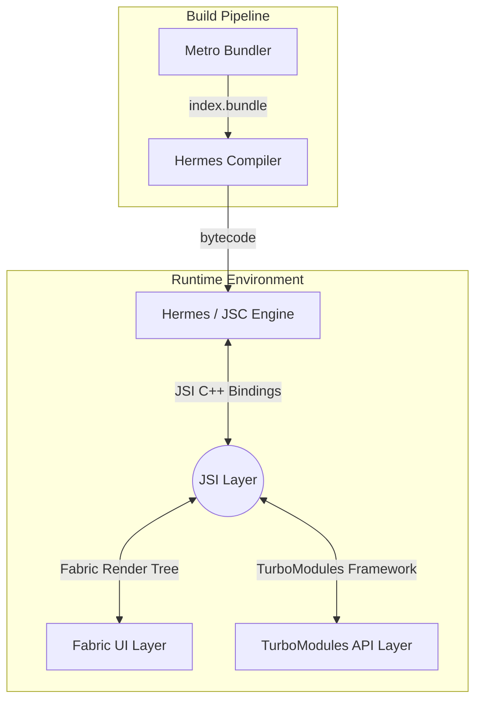

# Study Notes: Core React Native Terminology Reference

## Quick Recall
* **The Bundler:** **Metro** collects your individual asset files and glues them into one text package.
* **The Engines:** **Hermes** is the modern mobile-first bytecode compiler; **JSC** is the legacy engine that parses code at runtime.
* **The Conduit:** **JSI** provides the direct C++ memory tunnel that makes the New Architecture work.
* **The Workers:** **Fabric** handles drawing your UI elements synchronously, while **TurboModules** manage hardware features lazily.

---

## Architectural Taxonomy

### The Relationship Map

---

## Definition & Functional Breakdown

### 🚇 Metro
* **Definition:** A highly specialized JavaScript bundler built by Meta explicitly for React Native applications.
* **Primary Function:** Acts as the compile-time asset manager. It crawls your project dependency graph, merges JavaScript files, handles image density scaling, and outputs a single file (`index.bundle`).
* **Core Use Case:** Powering Fast Refresh during local development by streaming modified code changes (Deltas) down to the running device instantly.

### 🦅 Hermes
* **Definition:** An open-source, mobile-optimized JavaScript engine engineered by Meta to run React Native applications efficiently.
* **Primary Function:** Converts raw JavaScript strings into pre-optimized **`.hbc` binary bytecode** during your production build pipeline (Ahead-of-Time compilation).
* **Core Use Case:** Drastically shrinking app startup delays and slashing memory usage on Android and iOS devices by bypassing runtime code parsing.

### 🍏 JSC (JavaScriptCore)
* **Definition:** The standard open-source JavaScript engine developed by Apple that powers the Safari web browser.
* **Primary Function:** Historically acted as the default execution engine for React Native apps before Hermes was introduced. It parses and executes JavaScript strings on the fly inside the application.
* **Core Use Case:** Serving as the legacy runtime environment, though it is now phased out in modern React Native projects due to its larger file sizes and slower initialization footprints.

### 🔌 JSI (JavaScript Interface)
* **Definition:** A lightweight, framework-agnostic C++ abstraction layer that replaces the legacy React Native asynchronous bridge.
* **Primary Function:** Enables direct, synchronous communication between the JavaScript engine and the underlying native operating system. It allows JS to hold memory pointers to native C++ host objects.
* **Core Use Case:** Serving as the foundational highway that allows UI clicks, gestures, and native methods to execute synchronously without any JSON string serialization.

### 🎨 Fabric
* **Definition:** The completely re-engineered user interface rendering subsystem for React Native's New Architecture.
* **Primary Function:** Manages the creation of the application layout tree directly inside C++ (the Fabric Shadow Tree) and paints platform UI elements across multiple threads.
* **Core Use Case:** Eradicating visual lag, frame drops, and empty white screens by allowing high-priority user interactions (like scrolling or fast typing) to execute synchronously.

### ⚡ TurboModules
* **Definition:** The modern native architecture module framework that governs how JavaScript interacts with device hardware APIs.
* **Primary Function:** Replaces legacy native modules by utilizing JSI to give JavaScript direct synchronous method hooks into native code.
* **Core Use Case:** Enabling true lazy loading for heavy phone components (like Bluetooth, Location, or Camera wrappers). Native code is never loaded into the device's RAM until the exact millisecond your JavaScript calls for it.

---

## High-Level Component Matrix

| Component | Layer Type | System Phase | Core Language |
| :--- | :--- | :--- | :--- |
| **Metro** | Build Tool / Bundler | Compile Time | JavaScript |
| **Hermes** | Virtual Machine / Runtime Engine | Build & Runtime | C++ / Bytecode |
| **JSC** | Runtime Engine | Runtime Only | C++ / Assembly |
| **JSI** | Abstraction Bridge | Runtime Infrastructure | C++ |
| **Fabric** | Render Pipeline | Runtime Execution | C++ |
| **TurboModules**| Hardware API Layer | Runtime Execution | C++ / Objective-C / Java |

---

## Gotchas / Common Mistakes
* **Confusing Metro with Hermes:** Metro only organizes and *glues* your source code files together into text. Hermes is the engine that actually *reads*, optimizes, and runs that code.
* **Assuming JSI is a Downloadable Library:** You cannot standalone import JSI into a project. It is an internal architectural engine spec embedded directly within the React Native core.
* **Mixing Up Fabric and TurboModules:** Remember the separation of duties: **Fabric** owns what the user *sees* on the screen (UI components), while **TurboModules** own what the application *does* with device hardware (Native APIs).
