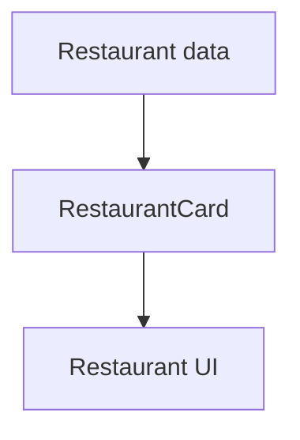
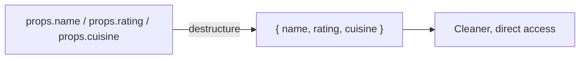
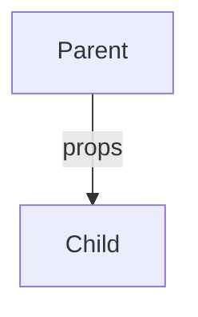
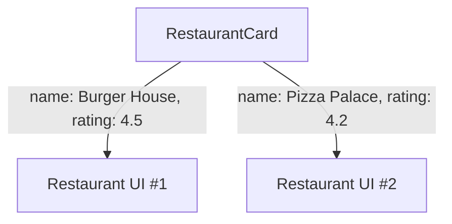
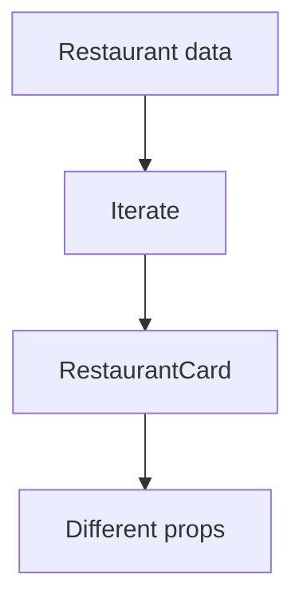
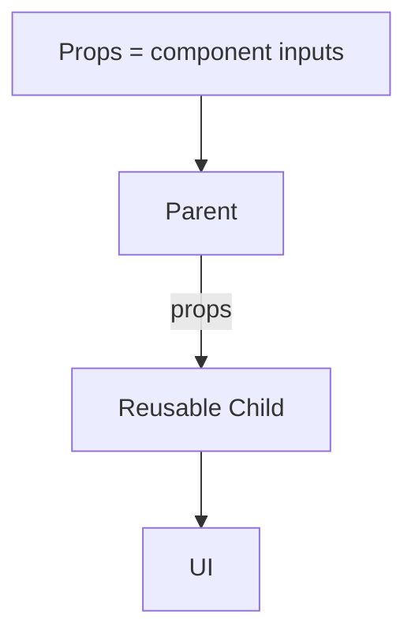
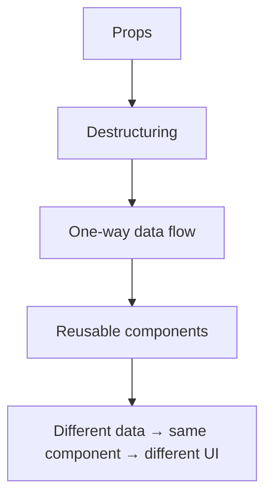

# Chapter 4 — Props + Reusable Components

**Status:** 🟢 COMPLETE

---

## 1. Why Reusable Components?

Create **one** component and give it different data instead of duplicating UI.



---

## 2. Props

**Props** are inputs passed from a parent to a child.

```jsx
function RestaurantCard(props) {
  return (
    <View>
      <Text>{props.name}</Text>
      <Text>{props.rating}</Text>
      <Text>{props.cuisine}</Text>
    </View>
  );
}
```

**Parent:**

```jsx
<RestaurantCard
  name="Burger House"
  rating={4.5}
  cuisine="Burgers"
/>
```

> `props.name` receives the value supplied through the `name` prop.

---

## 3. Destructuring

```jsx
function RestaurantCard({ name, rating, cuisine }) {
  return (
    <View>
      <Text>{name}</Text>
      <Text>{rating}</Text>
      <Text>{cuisine}</Text>
    </View>
  );
}
```



---

## 4. Props Are Read-Only From the Child



> Props are component inputs and follow **one-way parent → child** data flow.

---

## 5. Reuse

```jsx
<RestaurantCard name="Burger House" rating={4.5} cuisine="Burgers" />
<RestaurantCard name="Pizza Palace" rating={4.2} cuisine="Pizza" />
```

**One component can render different data.**



---

## 6. Connection to Lists

The Foodie project already combines reusable components with list operations:



> Formal arrays/`map`/`FlatList` material is skipped for now because it is already being used independently.

---

## 7. Mental Model



| Concept | Core Idea |
|---|---|
| Props | Inputs passed from parent to child |
| Destructuring | Cleaner way to read `props.x` as `{ x }` |
| Data flow | One-way: parent → child |
| Reuse | Same component, different data → different UI instances |

---

## ✅ Recall Checklist

- [ ] What a prop is, in one sentence
- [ ] Why `RestaurantCard` doesn't need to be written three separate times
- [ ] Why props flow one way (parent → child) and not the reverse
- [ ] What destructuring in the function signature is doing
- [ ] How the same component produces different UI output

---

## 🎯 Chapter 4 Complete


