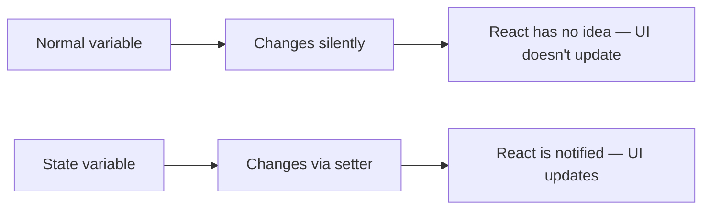
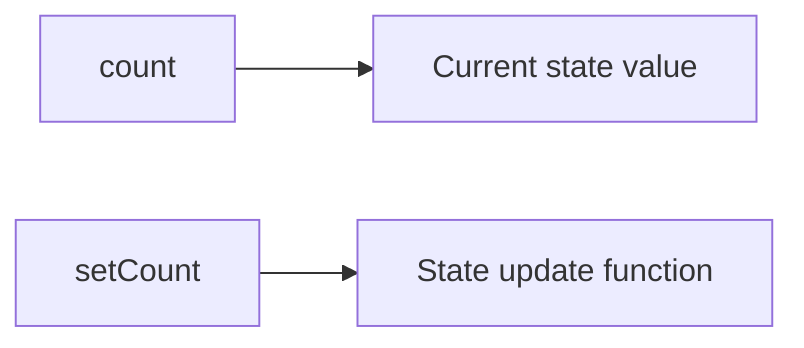
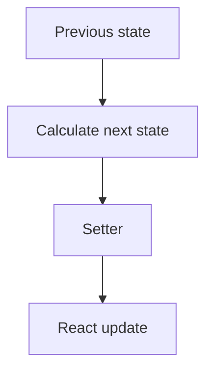
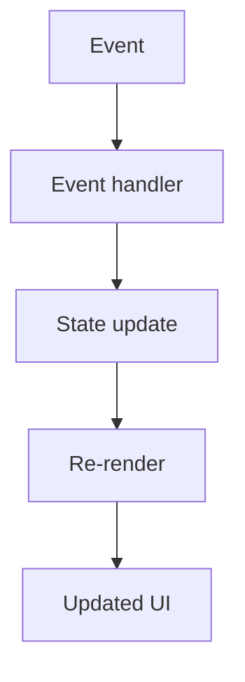
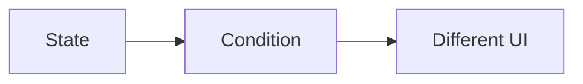
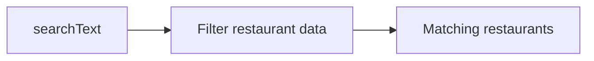
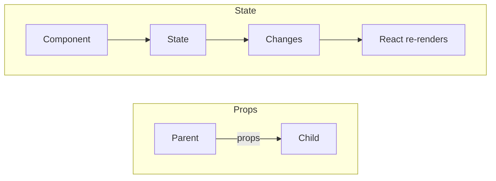
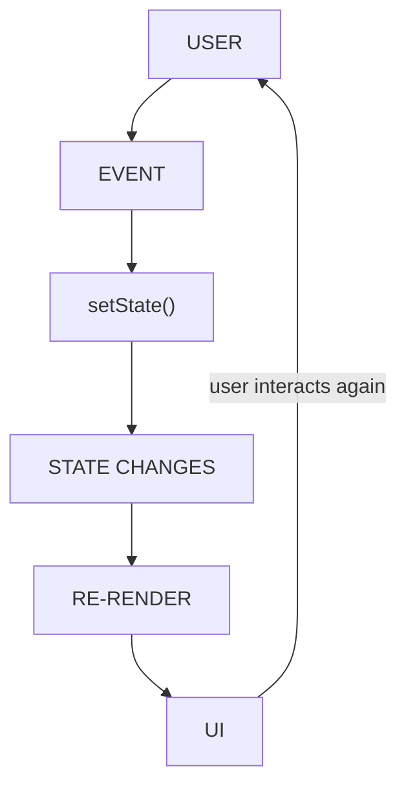
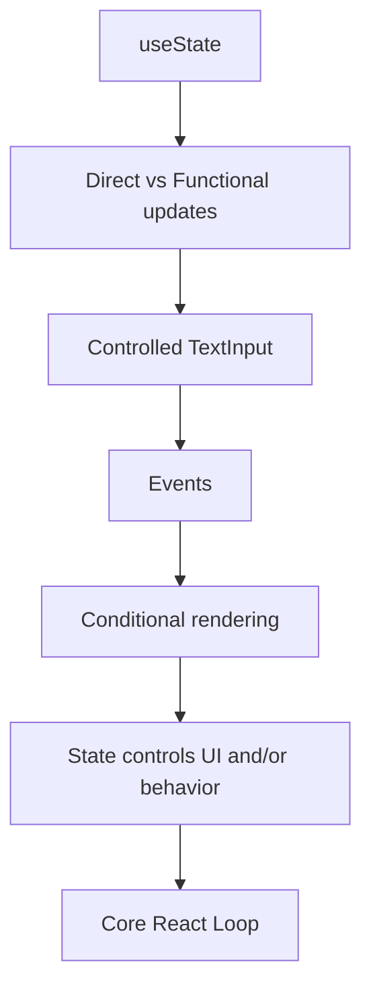

# Chapter 5 — State + Events

**Status:** 🟢 COMPLETE

---

## 1. What Is State?

**State** is data that belongs to a component and can change over time, where changes should cause React to update the UI.

```jsx
const [searchText, setSearchText] = useState("");
```

| Value | Meaning |
|---|---|
| `searchText` | Current state value |
| `setSearchText` | State update function |

---

## 2. Why Not a Normal Variable?

A normal variable can change, but React is **not notified** that it should update the UI. When the component function runs again, local variables are recreated.

> State provides React with persistent component data **plus** the update mechanism.



---

## 3. `useState`

```jsx
import { useState } from 'react';

const [count, setCount] = useState(0);
```



---

## 4. Direct State Update

```jsx
setCount(10);
```

> Means: set the state to exactly `10`.

---

## 5. Functional State Update

When the new state **depends on the previous state:**

```jsx
setCount(previous => previous + 1);
```

**Toggle:**

```jsx
setIsFavorite(previous => !previous);
```



---

## 6. Controlled `TextInput`

```jsx
<TextInput
  value={searchText}
  onChangeText={setSearchText}
/>
```

**Flow:**

```mermaid
flowchart TD
    A['User types "burger"'] --> B[onChangeText]
    B --> C['setSearchText("burger")']
    C --> D["searchText changes"]
    D --> E["React re-renders"]
    E --> F["Input reflects new value"]
```

---

## 7. Events

**Events** are user/system actions that trigger application logic.

| Component | Event |
|---|---|
| `Pressable` | `onPress` |
| `Pressable` | `onLongPress` |
| `TextInput` | `onChangeText` |
| `TextInput` | `onFocus` |
| `TextInput` | `onBlur` |

**General flow:**



---

## 8. Conditional Rendering

Render UI based on a condition:

```jsx
{isFavorite ? (
  <Text>❤️</Text>
) : (
  <Text>♡</Text>
)}
```



---

## 9. State Can Control Behavior

State does not need to be displayed directly.

**Example:**



> State can control UI, behavior, or **both**.

---

## 10. Props vs State



| | Props | State |
|---|---|---|
| Owned by | Parent | The component itself |
| Direction | Parent → Child (one-way) | Internal to the component |
| Mutability | Read-only in the child | Changed via its setter |
| Purpose | Configure a component from outside | Track data that changes over time |

---

## 11. Core React Loop



---

## 12. Examples

### Counter

```jsx
const [count, setCount] = useState(0);

<Pressable
  onPress={() => setCount(previous => previous + 1)}
>
  <Text>{count}</Text>
</Pressable>
```

### Favorite Toggle

```jsx
const [isFavorite, setIsFavorite] = useState(false);

<Pressable
  onPress={() => setIsFavorite(previous => !previous)}
>
  <Text>{isFavorite ? "❤️" : "♡"}</Text>
</Pressable>
```

---

## ✅ Recall Checklist

- [ ] What state is, and why a plain variable can't do the same job
- [ ] What the two values returned by `useState` represent
- [ ] When to use a direct update (`setCount(10)`) vs a functional update (`setCount(p => p + 1)`)
- [ ] Why functional updates matter when the new value depends on the old one
- [ ] What makes a `TextInput` "controlled"
- [ ] The full event → state → re-render → UI loop
- [ ] The core difference between props and state

---

## 🎯 Chapter 5 Complete


