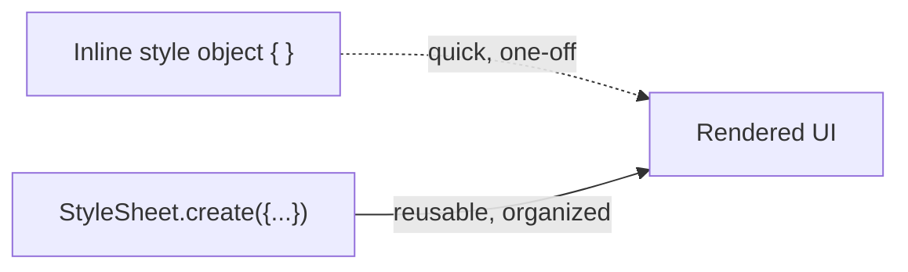
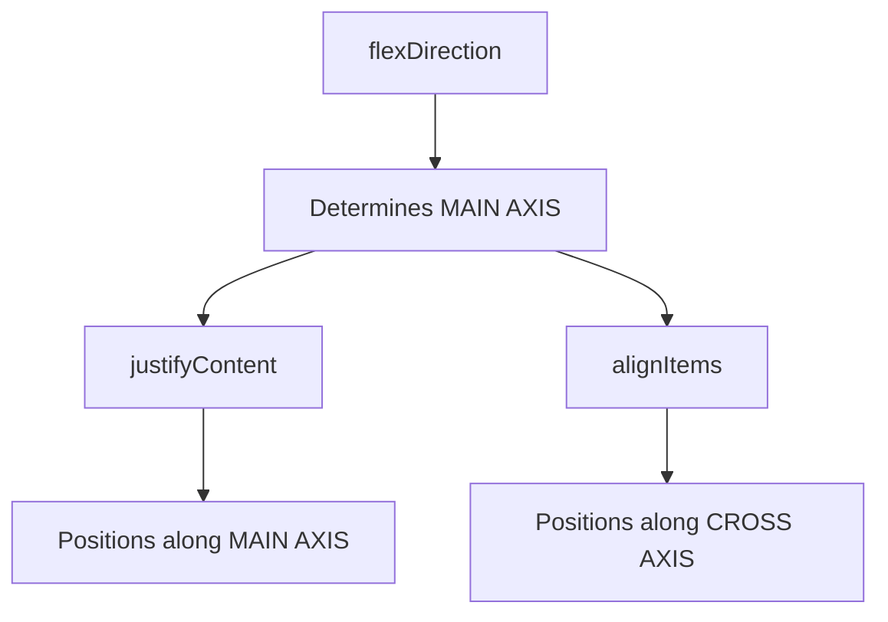
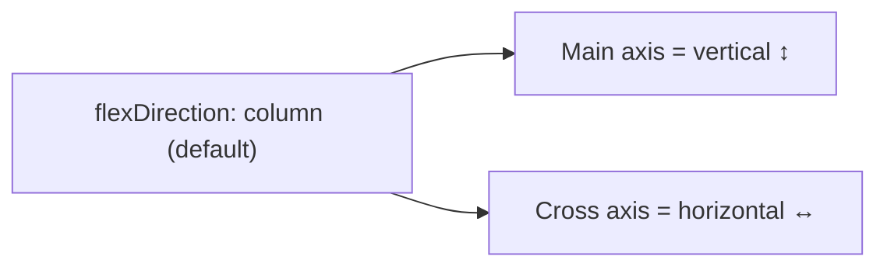
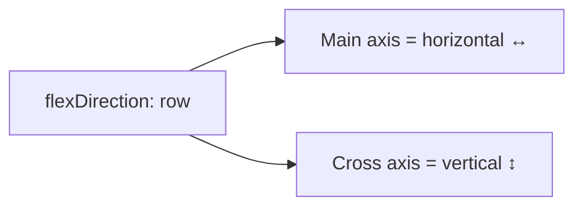
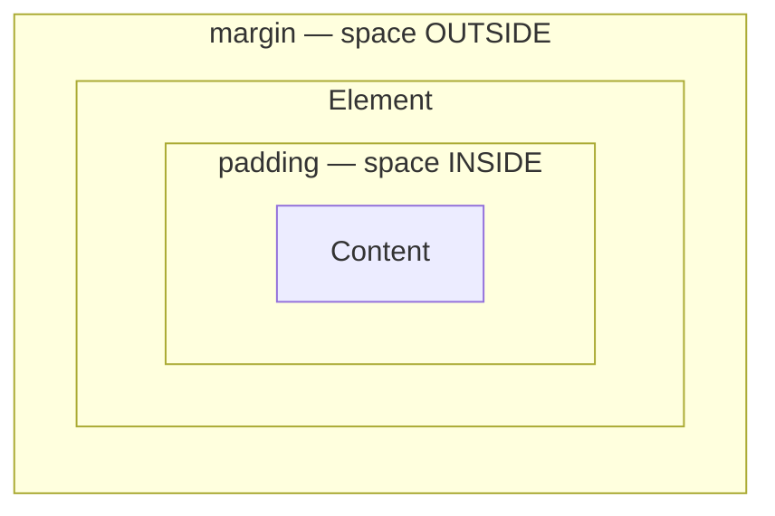
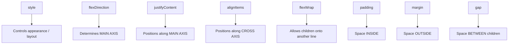
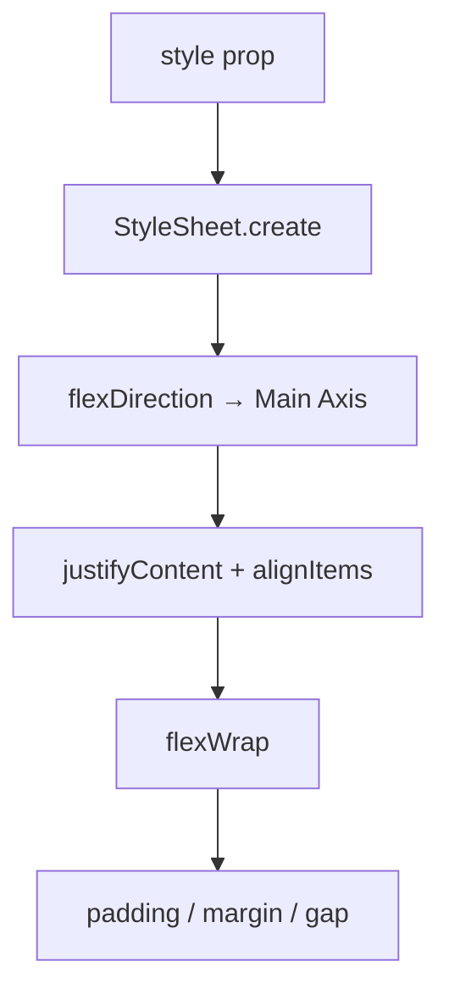

# Chapter 3 — Styling + Flexbox

**Status:** 🟢 COMPLETE

> Styling is intentionally kept to practical essentials; detailed styling can be handled when a specific UI problem requires it.

---

## 1. Covered in This Chapter

- `style` prop
- `StyleSheet.create()`
- Flexbox main/cross axes
- `flexDirection`
- `justifyContent`
- `alignItems`
- `flexWrap`
- `gap`
- `padding`
- `margin`

---

## 2. The `style` Prop

```jsx
<Text style={{ fontSize: 24 }}>
  Foodie
</Text>
```

---

## 3. `StyleSheet.create()`

```jsx
const styles = StyleSheet.create({
  title: {
    fontSize: 24,
    fontWeight: 'bold',
  },
});
```

Then:

```jsx
<Text style={styles.title}>Foodie</Text>
```



---

## 4. Flexbox Mental Model



### React Native's Default



### With `row`



| `flexDirection` | Main Axis | Cross Axis |
|---|---|---|
| `column` (default) | Vertical ↕ | Horizontal ↔ |
| `row` | Horizontal ↔ | Vertical ↕ |

---

## 5. Layout Properties

| Property | Effect |
|---|---|
| `justifyContent` | Positions children on the **main axis** |
| `alignItems` | Positions children on the **cross axis** |
| `flexWrap: 'wrap'` | Allows children onto another line |
| `gap` | Creates space **between** flex children |
| `padding` | Space **inside** an element |
| `margin` | Space **outside** an element |

### Padding vs Margin



---

## 6. Core Mental Model



| Concept | Core Idea |
|---|---|
| `style` | Controls appearance/layout |
| `flexDirection` | Determines **main axis** |
| `justifyContent` | Positions along **main axis** |
| `alignItems` | Positions along **cross axis** |
| `flexWrap` | Allows children onto another line |
| `padding` | Space **inside** |
| `margin` | Space **outside** |
| `gap` | Space **between** children |

---

## ✅ Recall Checklist

- [ ] Difference between inline `style` and `StyleSheet.create()`
- [ ] What determines the main axis vs the cross axis
- [ ] What `justifyContent` controls vs `alignItems`
- [ ] What `flexWrap: 'wrap'` does
- [ ] Difference between `padding`, `margin`, and `gap`
- [ ] Default `flexDirection` in React Native and what axes it produces

---

## 🎯 Chapter 3 Complete


