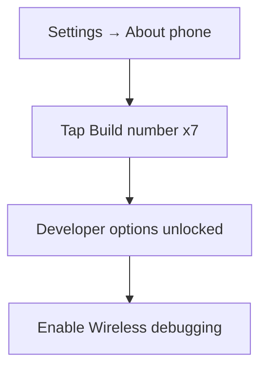
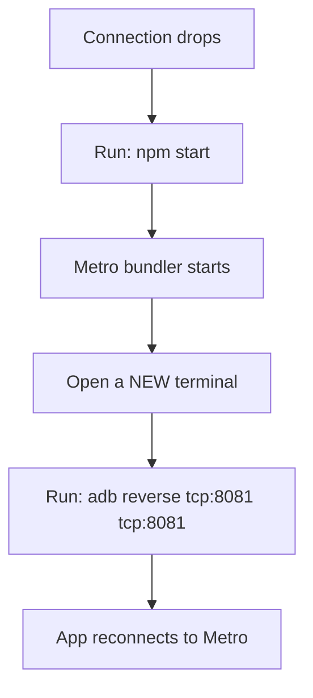
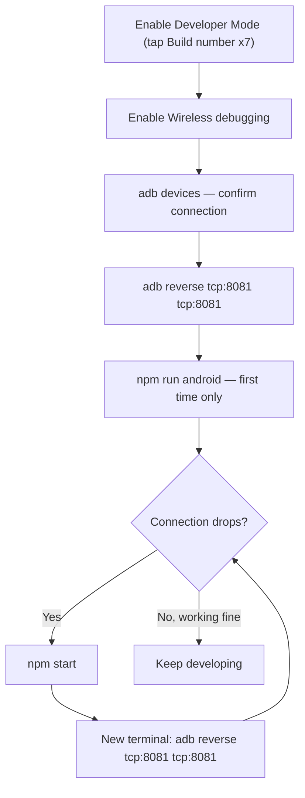

# ADB Wireless Debugging Setup Guide

> Quick reference for setting up React Native / Android development over ADB wireless, and recovering when the connection drops.

---

## 1. Enable Developer Mode on the Phone

| Step | Action |
|---|---|
| 1 | Go to **Settings → About phone** |
| 2 | Tap **Build number** **7 times** |
| 3 | Go back → **Settings → Developer options** |
| 4 | Enable **Wireless debugging** |



---

## 2. Verify Device Connection

Check which devices ADB currently sees:

```bash
adb devices
```

Get the connected device's model (confirms you're targeting the right device):

```bash
adb -s <device_id> shell getprop ro.product.model
```

---

## 3. First-Time Run

Set up the port forward, then launch the app:

```bash
adb -s <device_id> reverse tcp:8081 tcp:8081
```

```bash
npm run android
```

> `<device_id>` is the ID shown by `adb devices` (e.g. `192.168.1.5:5555` for wireless, or a serial for USB).

---

## 4. Recovering From a Dropped Connection

Wireless debugging disconnects often — usually when the phone sleeps or Metro restarts. Recovery sequence:



**Step-by-step:**

```bash
# 1. Restart Metro
npm start
```

```bash
# 2. In a NEW terminal window, re-forward the port
adb reverse tcp:8081 tcp:8081
```

> You don't need to re-run `npm run android` every time — once the app is already installed, restarting Metro + re-forwarding the port is enough.

---

## 5. Command Reference

| Command | Purpose |
|---|---|
| `adb devices` | List connected/authorized devices |
| `adb -s <device_id> shell getprop ro.product.model` | Check the model of a specific device |
| `adb -s <device_id> reverse tcp:8081 tcp:8081` | Forward Metro's port to a specific device |
| `adb reverse tcp:8081 tcp:8081` | Forward Metro's port to the default/only device |
| `npm run android` | Build + install + launch the app (first run) |
| `npm start` | Start the Metro bundler only |

---

## 6. Full Workflow at a Glance


